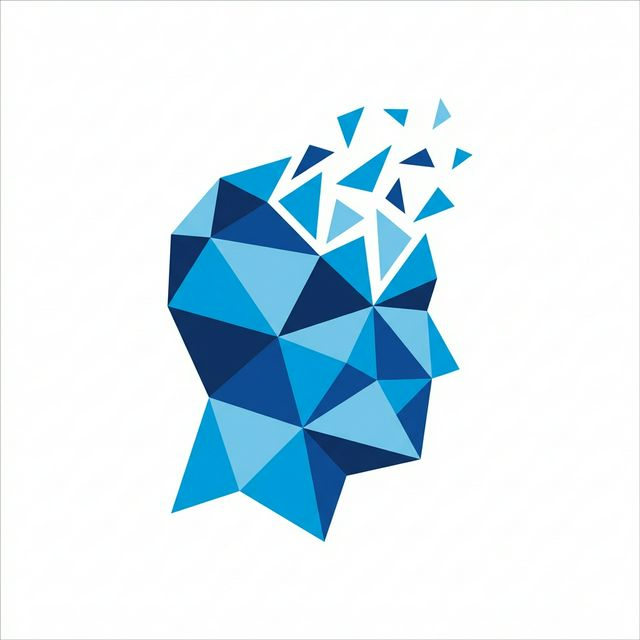
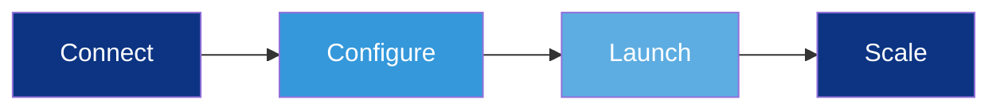

<div align="center">
  
  <h1>🔮 Alchemy AI</h1>
  <p><b>5 AI Agents working 24/7 to grow your business.</b></p>
  
  [](https://github.com/Daaksh05/alchemy-reachout-engine)
  [](#technology-stack)
  [](#license)
</div>

---

## 🚀 Overview

Alchemy AI transforms your business growth by deploying a specialized team of autonomous agents. From finding hyper-qualified leads to scales outreach, Alchemy handles the hard work while you focus on closing deals.

### Why Choose Alchemy?
- ✅ **24/7 Automation**: No breaks, no management.
- ✅ **Ultra-Premium Design**: Glassmorphism and advanced animations.
- ✅ **Data-Driven**: Real-time analytics and tracking.

---

## 🤖 The Agent Team

| Agent | Purpose | Key Feature |
| :--- | :--- | :--- |
| **🔍 Lead Finder** | Prospecting | Searches 150+ sources automatically |
| **📧 Lead Outreach** | Engagement | AI-powered personal messages at scale |
| **🎨 Content Repurposer**| Marketing | 1 piece → 10+ formats instantly |
| **📊 CMS Dashboard** | Management| Unified control & real-time metrics |
| **📈 SEO Copilot** | Optimization| Automated audits & rank tracking |

---

## ⚡ How It Works



1. **Connect**: Link your email, CRM, and social platforms in 60 seconds.
2. **Configure**: Tell Alchemy your target audience and growth goals.
3. **Launch**: 5 agents start working immediately.
4. **Scale**: Watch results appear on your live dashboard.

---

## 🛠 Technology Stack

- **Frontend**: HTML5, CSS3 (Vanilla), JavaScript (ES6+)
- **Animations**: CSS Keyframes, Intersection Observer API
- **Design System**: Glassmorphism, Premium Gradients, Responsive Layout

---

## 🚀 Getting Started

1. **Clone the repo**
   ```bash
   git clone https://github.com/Daaksh05/alchemy-reachout-engine.git
   ```
2. **Open the site**
   Simply open `index.html` in your favorite browser.

---

## 👥 The Founders

- **Sanjaykumaran** - CEO & Co-Founder
- **Daakshayani** - CTO & Co-Founder

---

<div align="center">
  <p>Built with ❤️ for modern businesses.</p>
  <a href="#hero"><b>Back to Top ↑</b></a>
</div>
